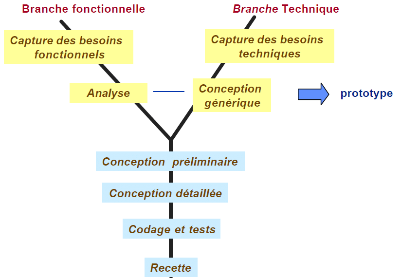

    
    

## **Watches E-commerce**

- Présenté par: Aoulad amar Samir
- Encadré par: ESSARRAJ Fouad

---

### **1. Introduction:**

---

### **2. Methode de travail:**

- 2.1. Scrum
- 2.2. 2TUP

|||

#### **2.1. Scrum:**

|||

#### **2.2. 2TUP:**

---

### **3. Planification:**

|||

#### **3.1. Planification:**

<table style="font-size: 28px" >
  <tr>
    <th></th>
    <th>1</th>
    <th>2</th>
    <th>3</th>
  </tr>
  <tr>
    <td>Monday</td>
    <td>Planning</td>
    <td>Self Training</td>
    <td>Self Training</td>
  </tr>
  <tr>
    <td>Tuesday</td>
    <td>-</td>
    <td>-</td>
    <td>Prepering slides</td>
  </tr>
  <tr>
    <td>Wednesday</td>
    <td>Workshop</td>
    <td>Workshop</td>
    <td>Technical + Functional branches</td>
  </tr>
  <tr>
    <td>Thursday</td>
    <td>Prototype</td>
    <td>Prototype</td>
    <td>Fil rouge</td>
  </tr>
  <tr>
    <td>Friday</td>
    <td>Realization</td>
    <td>Realization</td>
    <td>-</td>
  </tr>
  <tr>
    <td>Monday</td>
    <td>Realization</td>
    <td>Realization</td>
    <td>Realization</td>
  </tr>
  <tr>
    <td>Tuesday</td>
    <td>-</td>
    <td>-</td>
    <td>Realization</td>
  </tr>
  <tr>
    <td>Wednesday</td>
    <td>Realization</td>
    <td>Realization</td>
    <td>Realization</td>
  </tr>
  <tr>
    <td>Thursday</td>
    <td>Realization</td>
    <td>Realization</td>
    <td>Realization</td>
  </tr>
  <tr>
    <td>Friday</td>
    <td>Realization</td>
    <td>Realization</td>
    <td>-</td>
  </tr>
</table>

|||

#### **3.2. Diagramme de Gantt:**

---

### **4. Branche technique:**

- 4.1. Capture de besoins techniques
- 4.2. Analyse technique
- 4.3. Auto-formation
- 4.4. Conception generique 

|||

#### **4.1. Capture de besoins techniques:**

- Tailwind CSS
- Ajax
- Laravel
- MySQL

|||

#### **4.2. Analyse technique:**

- Laravel Avancé
- One page application (AJAX)

|||

#### **4.3. Auto-formation:**

- Blade Avancé
- Controller Avancé
- Model Avancé
- Manager
- Ajax

|||

#### **4.4. Conception generique:**

- afficher un produit
- ajouter un produit
- supprimer un produit
- one-page
- Manager

---

### **5. Branche fonctionnelle:**

- 5.1. Capture de besoins fonctionnels
- 5.2. Analyse fonctionnelle
- 5.3. Sprint 1
- 5.4. Sprint 2

|||

#### **5.1. Capture de besoins fonctionnels:**

|||

#### **5.2. Analyse fonctionnelle:**

|||

#### **5.3. Sprint 1:**

|||

#### **5.4. Sprint 2:**

---

### **6. Conception:**

- 6.1. Diagramme de class
- 6.2. Maquette

|||

#### **6.1. Diagramme de class:**

|||

#### **6.2. Maquette:**

---

### **7. Réalisation:**

---

### **8. Conclusion:**
